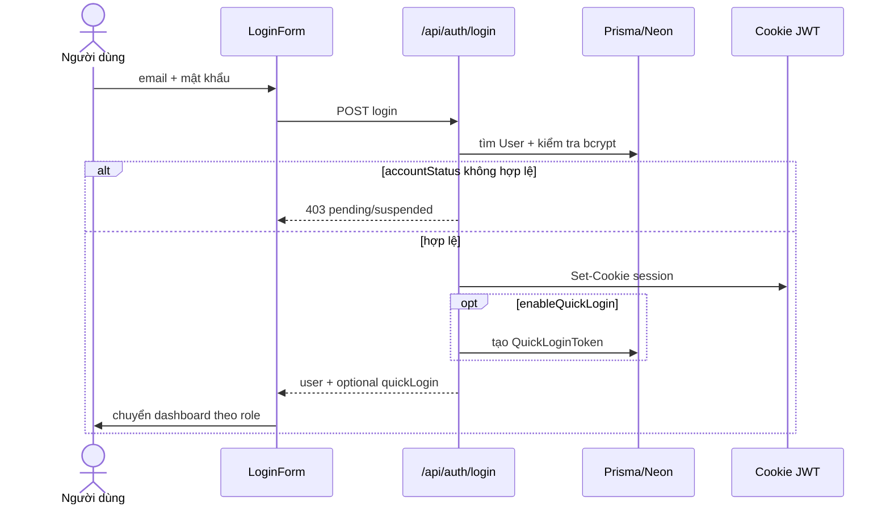
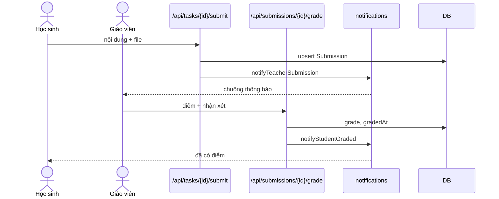
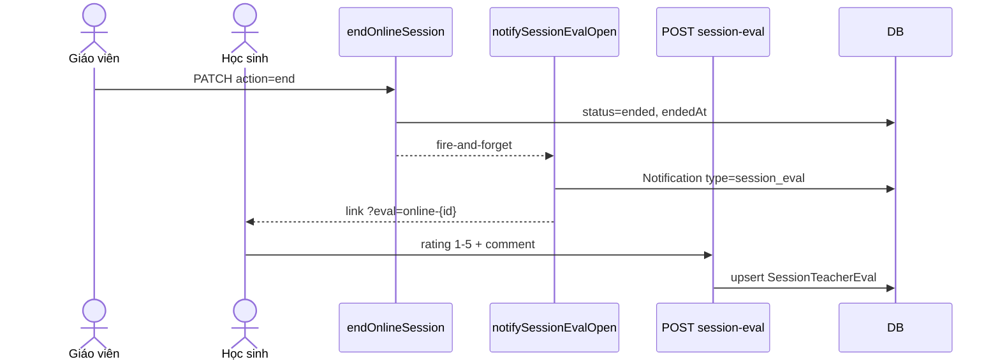

# Sơ đồ trình tự (Sequence Diagram)

## 1. Đăng nhập thường

```mermaid
sequenceDiagram
  actor U as Người dùng
  participant UI as LoginForm
  participant API as /api/auth/login
  participant DB as Prisma/Neon
  participant C as Cookie JWT

  U->>UI: email + mật khẩu
  UI->>API: POST login
  API->>DB: tìm User + kiểm tra bcrypt
  alt accountStatus không hợp lệ
    API-->>UI: 403 pending/suspended
  else hợp lệ
    API->>C: Set-Cookie session
    opt enableQuickLogin
      API->>DB: tạo QuickLoginToken
    end
    API-->>UI: user + optional quickLogin
    UI->>U: chuyển dashboard theo role
  end
```

## 2. Nộp bài và chấm

```mermaid
sequenceDiagram
  actor HS as Học sinh
  actor GV as Giáo viên
  participant S as /api/tasks/{id}/submit
  participant G as /api/submissions/{id}/grade
  participant N as notifications
  participant DB as DB

  HS->>S: nội dung + file
  S->>DB: upsert Submission
  S->>N: notifyTeacherSubmission
  N-->>GV: chuông thông báo
  GV->>G: điểm + nhận xét
  G->>DB: grade, gradedAt
  G->>N: notifyStudentGraded
  N-->>HS: đã có điểm
```

## 3. Kết thúc buổi online → đánh giá

```mermaid
sequenceDiagram
  actor GV as Giáo viên
  actor HS as Học sinh
  participant OS as endOnlineSession
  participant EV as notifySessionEvalOpen
  participant API as POST session-eval
  participant DB as DB

  GV->>OS: PATCH action=end
  OS->>DB: status=ended, endedAt
  OS-->>EV: fire-and-forget
  EV->>DB: Notification type=session_eval
  EV-->>HS: link ?eval=online-{id}
  HS->>API: rating 1-5 + comment
  API->>DB: upsert SessionTeacherEval
```
