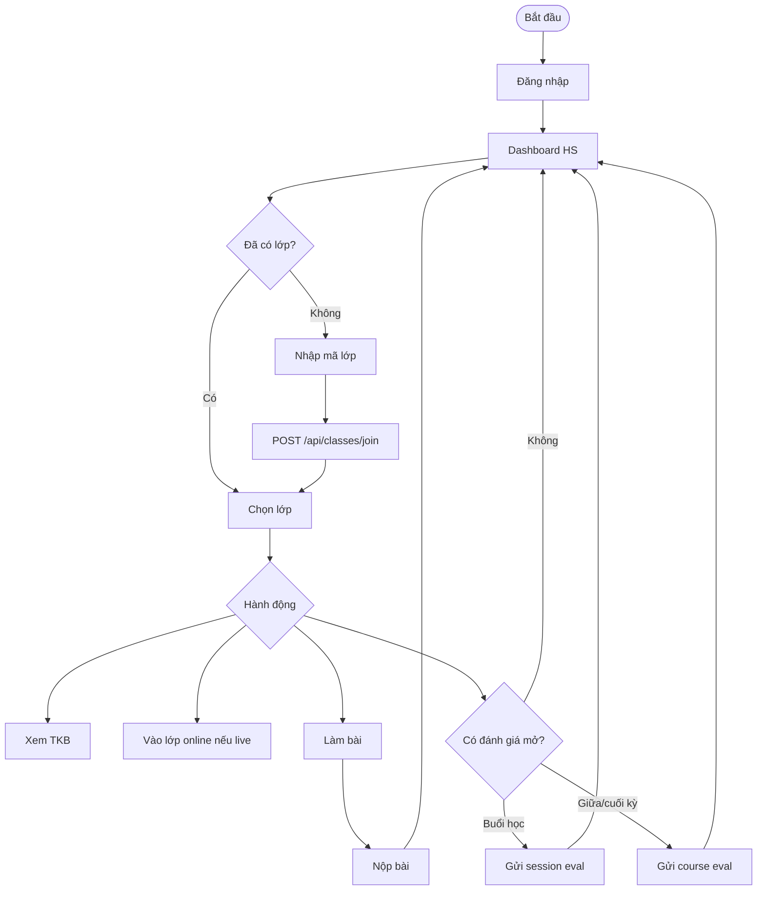
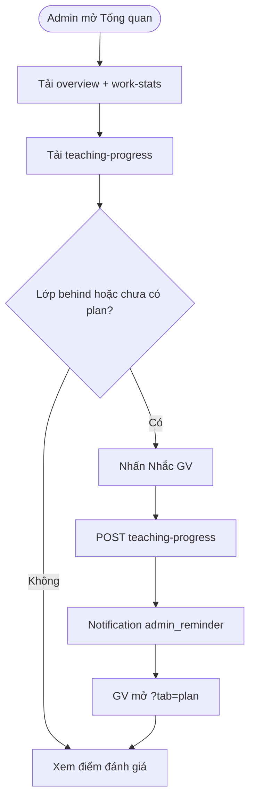

# Sơ đồ hoạt động (Activity Diagram)

## Học sinh tham gia lớp và học

```mermaid
flowchart TD
  start([Bắt đầu]) --> login[Đăng nhập]
  login --> dash[Dashboard HS]
  dash --> join{Đã có lớp?}
  join -->|Không| code[Nhập mã lớp]
  code --> enroll[POST /api/classes/join]
  join -->|Có| pick[Chọn lớp]
  enroll --> pick
  pick --> act{Hành động}
  act --> viewTKB[Xem TKB]
  act --> enter[Vào lớp online nếu live]
  act --> hw[Làm bài]
  hw --> submit[Nộp bài]
  act --> eval{Có đánh giá mở?}
  eval -->|Buổi học| se[Gửi session eval]
  eval -->|Giữa/cuối kỳ| ce[Gửi course eval]
  eval -->|Không| dash
  submit --> dash
  se --> dash
  ce --> dash
```

## Admin giám sát giảng dạy

```mermaid
flowchart TD
  A([Admin mở Tổng quan]) --> B[Tải overview + work-stats]
  B --> C[Tải teaching-progress]
  C --> D{Lớp behind hoặc chưa có plan?}
  D -->|Có| E[Nhấn Nhắc GV]
  E --> F[POST teaching-progress]
  F --> G[Notification admin_reminder]
  G --> H[GV mở ?tab=plan]
  D -->|Không| I[Xem điểm đánh giá]
  H --> I
```
